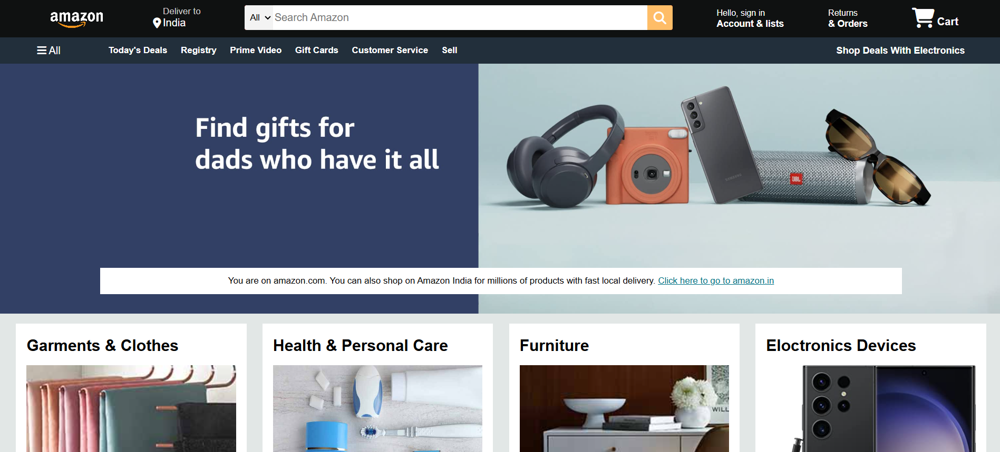

# Amazon Clone (HTML + CSS)

This is my first web development project — a simple static clone of Amazon's homepage using only HTML and CSS. It's designed to help me understand layout structures, styling, and image handling.

## 🔍 Project Structure

/Amazon-Clone
├── index.html
├── style.css
├── images/
└── .vscode/

## 🛠️ Tech Stack

- HTML
- CSS

## 📸 Screenshots

## 📌 Note

This project is built purely for learning and practicing front-end development. It is not connected to any backend or real database.

## 📬 Connect with Me

- LinkedIn: [Manas Ranjan Jena](https://www.linkedin.com/in/manas-ranjan-jena/)
- GitHub: [@manasranjanjena68](https://github.com/manasranjanjena68)

# Amazon Clone (HTML + CSS)

This is my first web development project — a simple static clone of Amazon's homepage using only HTML and CSS. It's designed to help me understand layout structures, styling, and image handling.

## 🔍 Project Structure

## 🧠 What I Learned

- HTML structure and semantic tags
- CSS styling and layout techniques
- Positioning and Flexbox/Grid basics
- Organizing project files

## 💡 Features

- Basic Amazon-like homepage layout
- Header with logo, search bar, and nav
- Static product section with images
- Fully responsive design (if applicable)

## 📸 Screenshot

*(Add a screenshot of your homepage here)*

## 🛠️ Tech Used

- HTML5
- CSS3

## 📬 Connect with Me

- GitHub: [@manasranjanjena68](https://github.com/manasranjanjena68)
- LinkedIn: [Manas Ranjan Jena](https://www.linkedin.com/in/manas-ranjanjena/)

---

> This project was built purely for practice and educational purposes.
